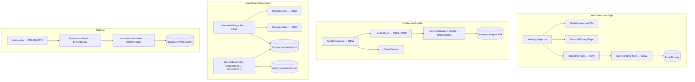

# Design Document: Frontend Enterprise Features

## Overview

This document covers the technical design for four enterprise-grade frontend features on the StellarStream platform:

1. **#1006 — Enterprise Customization Theme Editor** (Branding tab in Settings)
2. **#1007 — X-Ray Component Stress Test** (500+ recipient performance testing)
3. **#1009 — Organization-Health Command Center** (executive dashboard)
4. **#1010 — Transaction-Flow Live Feed** (real-time sidebar activity feed)

All four features are built on the existing Next.js App Router + TypeScript stack, using Tailwind CSS and the Stellar Glass design system (`--stellar-primary: #00f5ff`, `--stellar-secondary: #8a00ff`, `glass-card` utility, BentoCard pattern, DM Mono + Syne fonts).

---

## Architecture

The features integrate into the existing dashboard shell without introducing new routing paradigms or external dependencies beyond what is already present.



### Key Design Decisions

**Branding persistence via localStorage first**: The requirements specify "localStorage (or API if available)". The design uses localStorage as the primary store with an optional API call. This avoids a hard dependency on a backend endpoint that may not exist yet, while keeping the door open for server-side persistence.

**Settings page tab pattern**: The existing `settings/page.tsx` stacks sections vertically rather than using a tab component. The Branding section follows the same stacking pattern, placed after Gas Management and before Security & Privacy, matching the visual hierarchy.

**Virtualized grid via `@tanstack/react-virtual`**: The project already uses React; `@tanstack/react-virtual` is the standard choice for virtualized lists in the React ecosystem and avoids rendering 500 DOM nodes at once.

**Map clustering via `react-leaflet` + `leaflet.markercluster`**: Leaflet is the most widely used mapping library for React without a paid API key requirement. Marker clustering is essential for 500+ markers to remain performant.

**TransactionFeed enhanced in-place**: Rather than creating a parallel `LogFeed` component, the existing `TransactionFeed` component is enhanced to meet all requirements. This avoids a dead component and keeps the sidebar import unchanged.

---

## Components and Interfaces

### Feature 1: Branding Tab

#### New Files
- `frontend/components/settings/BrandingPage.tsx`
- `frontend/lib/hooks/use-branding.ts`

#### Modified Files
- `frontend/app/dashboard/settings/page.tsx` — add `<BrandingPage />` section

#### `BrandingConfig` interface

```typescript
interface BrandingConfig {
  logoUrl: string | null;       // data URL or remote URL
  primaryColor: string;         // CSS hex, e.g. "#00f5ff"
}
```

#### `use-branding` hook interface

```typescript
interface UseBrandingReturn {
  config: BrandingConfig;
  saving: boolean;
  saveError: string | null;
  updateColor: (color: string) => void;   // updates CSS var in real time
  updateLogo: (file: File) => void;       // validates + sets preview URL
  saveConfig: () => Promise<void>;        // persists to localStorage / API
  logoError: string | null;              // inline file validation error
}
```

#### `validateLogoFile` pure function

```typescript
// Exported for testing
export function validateLogoFile(file: File): string | null {
  const ALLOWED_TYPES = ['image/png', 'image/jpeg', 'image/svg+xml'];
  const MAX_SIZE_BYTES = 2 * 1024 * 1024; // 2 MB
  if (!ALLOWED_TYPES.includes(file.type)) {
    return `File type "${file.type}" is not supported. Please upload a PNG, JPG, or SVG.`;
  }
  if (file.size > MAX_SIZE_BYTES) {
    return `File size ${(file.size / 1024 / 1024).toFixed(1)} MB exceeds the 2 MB limit.`;
  }
  return null; // valid
}
```

#### `BrandingPage` component structure

```
BrandingPage
├── Page Header (BentoCard, DM Mono / Syne fonts, matching SecurityPrivacyPage pattern)
├── LogoUploadCard (BentoCard)
│   ├── <input type="file" accept=".png,.jpg,.jpeg,.svg" />
│   ├── Inline validation error (if logoError)
│   └── Logo preview thumbnail
├── ColorPickerCard (BentoCard)
│   ├── <input type="color" /> — triggers updateColor on every change event
│   └── Hex value display (DM Mono)
├── LivePreviewCard (BentoCard)
│   └── Mock Split-Link card showing logo + primary color applied
└── SaveButton → calls saveConfig(), shows success/error toast
```

The Live Preview mock card renders a simplified Split-Link layout using the current `--stellar-primary` CSS variable so it reflects color changes in real time without any additional state.

---

### Feature 2: X-Ray Stress Test

#### New Files
- `frontend/components/dashboard/RecipientGrid.tsx`
- `frontend/components/dashboard/RecipientMap.tsx`
- `frontend/app/dashboard/stress-test/page.tsx`

#### Modified Files
- `scripts/generate-dummy-recipients.ts` — add exit-code guard, ensure CSV output, log file paths

#### `Recipient` interface

```typescript
interface Recipient {
  id: number;
  address: string;
  label: string;
  amount: string;
  token: string;
  taxId?: string;           // optional
  transactions: number;
  lastActive: string;       // ISO 8601
  lat?: number;             // for map rendering
  lng?: number;             // for map rendering
}
```

#### `RecipientGrid` component

Uses `@tanstack/react-virtual` for row virtualization. The row component is wrapped in `React.memo` to prevent re-renders when props are unchanged.

```typescript
// Row component — memoized
const RecipientRow = React.memo(function RecipientRow({ recipient }: { recipient: Recipient }) {
  // renders one <tr> with address, label, amount, token, transactions, lastActive
});

export function RecipientGrid({ recipients }: { recipients: Recipient[] }) {
  const parentRef = useRef<HTMLDivElement>(null);
  const rowVirtualizer = useVirtualizer({
    count: recipients.length,
    getScrollElement: () => parentRef.current,
    estimateSize: () => 48,
    overscan: 10,
  });
  // renders virtualized rows inside a fixed-height scrollable container
}
```

TTI measurement is done in the stress-test page:

```typescript
const t0 = performance.now();
// render RecipientGrid
// in useEffect after first paint:
const tti = performance.now() - t0;
console.log(`RecipientGrid TTI: ${tti.toFixed(1)}ms`);
```

#### `RecipientMap` component

Uses `react-leaflet` with `react-leaflet-markercluster` for clustering. Recipients without lat/lng are assigned random coordinates within a bounding box for demo purposes.

```typescript
export function RecipientMap({ recipients }: { recipients: Recipient[] }) {
  // MapContainer + TileLayer + MarkerClusterGroup
  // Each recipient renders as a <Marker> inside the cluster group
}
```

#### Script enhancements

The existing script already generates 500 records and writes both files. The enhancements are:

1. Add a try/catch around the `faker` import with a `process.exit(1)` and `process.stderr.write(...)` on failure.
2. Log the exact file paths and record count on success.
3. Add `lat` and `lng` fields to `DummyRecipient` for map rendering.

---

### Feature 3: Organization-Health Command Center

#### New Files
- `frontend/app/dashboard/health/page.tsx`

#### Modified Files
- `frontend/components/dashboard/HealthCard.tsx` — loading skeleton, per-tile error + retry, formatted values
- `frontend/lib/hooks/use-organization-health.ts` — auto-refresh every 5 min, retry capability, error handling
- `frontend/components/dashboard/sidebar.tsx` — add "Health" nav item

#### Enhanced `useOrganizationHealth` hook interface

```typescript
interface UseOrganizationHealthReturn {
  data: OrganizationHealthData | null;
  loading: boolean;
  error: string | null;
  retry: () => void;           // triggers a manual re-fetch
  lastFetchedAt: number | null; // Date.now() timestamp of last successful fetch
}
```

Auto-refresh implementation uses `setInterval` inside `useEffect` with a 5-minute interval (300,000 ms). The interval is cleared on unmount.

#### Enhanced `HealthCard` component structure

```
HealthCard
├── [loading] → 3× skeleton tiles (animated shimmer)
├── [error]   → error message + "Retry" button per tile
└── [data]    → 3 metric tiles
    ├── Success Rate: formatSuccessRate(data.successRate) → "98.5%"
    ├── Total Volume: formatUsdValue(data.totalVolume30d) → "$1,250,000"
    └── Active Proposals: Math.floor(data.activeProposals).toString()
```

#### `formatSuccessRate` pure function

```typescript
// Exported for testing
export function formatSuccessRate(rate: number): string {
  return `${rate.toFixed(1)}%`;
}
```

#### Health page layout

```
/dashboard/health
├── Page header (title, subtitle)
├── GlobalSearch component (from frontend/components/globalsearch.tsx)
└── HealthCard (3 metric tiles with loading/error states)
```

The `GlobalSearch` component is imported directly. No modifications to `globalsearch.tsx` are needed — it already supports keyboard navigation, recent searches, and CMD+K.

---

### Feature 4: Transaction-Flow Live Feed

#### Modified Files
- `frontend/components/dashboard/TransactionFeed.tsx` — enhanced in-place
- `frontend/lib/hooks/use-transaction-feed.ts` — exponential back-off, reconnecting state, connectionLost state
- `frontend/components/dashboard/sidebar.tsx` — hide feed when `collapsed === true`

#### Enhanced `useTransactionFeed` hook interface

```typescript
export interface TransactionFeedItem {
  id: string;
  type: 'stream_created' | 'recipient_added' | 'split_approved' | 'ledger_confirmation' | string;
  description: string;
  timestamp: string;       // ISO 8601
  actor?: string;
  asset?: string;
  amount?: string;
  status?: string;
}

interface UseTransactionFeedReturn {
  feed: TransactionFeedItem[];
  loading: boolean;
  error: string | null;
  reconnecting: boolean;        // true during back-off attempts
  reconnectAttempt: number;     // 1–5
  connectionLost: boolean;      // true after all 5 attempts fail
}
```

#### Exponential back-off reconnection

The hook manages reconnection manually rather than relying on Socket.IO's built-in `reconnectionAttempts` option, to expose `reconnecting` and `connectionLost` state to the UI.

```typescript
const BACKOFF_DELAYS_MS = [1000, 2000, 4000, 8000, 16000]; // 5 attempts

// On disconnect:
// attempt 1 → wait 1s → reconnect
// attempt 2 → wait 2s → reconnect
// attempt 3 → wait 4s → reconnect
// attempt 4 → wait 8s → reconnect
// attempt 5 → wait 16s → reconnect
// all failed → set connectionLost = true
```

Socket.IO is initialized with `reconnection: false` so the hook controls all reconnection logic.

#### Feed state management

```typescript
// On 'transaction-event':
setFeed(prev => [newItem, ...prev].slice(0, 50));

// On 'ledger-confirmation':
setFeed(prev => {
  const idx = prev.findIndex(item => item.id === data.id);
  if (idx !== -1) {
    const updated = [...prev];
    updated[idx] = { ...updated[idx], ...data };
    return updated;
  }
  return [data, ...prev].slice(0, 50);
});
```

#### `formatFeedDescription` pure function

```typescript
// Exported for testing
export function formatFeedDescription(item: TransactionFeedItem): string {
  switch (item.type) {
    case 'recipient_added':
      return `${item.actor ?? 'Unknown'} added a recipient`;
    case 'split_approved':
      return `${item.asset ?? 'Unknown'} Split Approved`;
    default:
      return item.description;
  }
}
```

#### `formatRelativeTime` pure function

```typescript
// Exported for testing
export function formatRelativeTime(timestamp: string): string {
  const diffMs = Date.now() - new Date(timestamp).getTime();
  const diffSec = Math.floor(diffMs / 1000);
  if (diffSec < 60) return `${diffSec}s ago`;
  const diffMin = Math.floor(diffSec / 60);
  if (diffMin < 60) return `${diffMin}m ago`;
  const diffHr = Math.floor(diffMin / 60);
  return `${diffHr}h ago`;
}
```

#### ARIA structure

```html
<div role="feed" aria-label="Transaction activity feed" aria-busy={loading}>
  {feed.map(item => (
    <article role="article" key={item.id} tabIndex={0} aria-label={formatFeedDescription(item)}>
      <!-- icon, description, timestamp -->
    </article>
  ))}
</div>
```

#### Sidebar integration

The `TransactionFeed` render in `sidebar.tsx` is wrapped in a conditional:

```tsx
{/* Transaction Feed — hidden when collapsed */}
{!collapsed && (
  <div className="mt-4">
    <TransactionFeed />
  </div>
)}
```

---

## Data Models

### BrandingConfig (localStorage key: `stellar_branding`)

```typescript
interface BrandingConfig {
  logoUrl: string | null;
  primaryColor: string;   // default: "#00f5ff"
}
```

Stored as JSON. On load, if the key is absent, defaults are applied: `primaryColor = "#00f5ff"`, `logoUrl = null`.

### OrganizationHealthData (existing, no changes to shape)

```typescript
interface OrganizationHealthData {
  successRate: number;      // 0–100 (percentage)
  totalVolume30d: number;   // USD equivalent
  activeProposals: number;  // integer count
}
```

### Recipient (stress test)

```typescript
interface Recipient {
  id: number;
  address: string;
  label: string;
  amount: string;
  token: string;
  taxId?: string;
  transactions: number;
  lastActive: string;   // ISO 8601
  lat?: number;
  lng?: number;
}
```

### TransactionFeedItem (enhanced)

```typescript
interface TransactionFeedItem {
  id: string;
  type: string;
  description: string;
  timestamp: string;    // ISO 8601
  actor?: string;
  asset?: string;
  amount?: string;
  status?: string;
}
```

---

## Correctness Properties

*A property is a characteristic or behavior that should hold true across all valid executions of a system — essentially, a formal statement about what the system should do. Properties serve as the bridge between human-readable specifications and machine-verifiable correctness guarantees.*

### Property 1: Logo file validation accepts valid files and rejects invalid ones

*For any* `File` object, `validateLogoFile(file)` SHALL return `null` if and only if the file's MIME type is one of `{image/png, image/jpeg, image/svg+xml}` AND the file's size is ≤ 2,097,152 bytes (2 MB). For any file that violates either constraint, the function SHALL return a non-empty error string.

**Validates: Requirements 1.3, 1.4**

---

### Property 2: Color picker update propagates to CSS custom property

*For any* valid CSS hex color string (matching `#[0-9a-fA-F]{6}`), calling `updateColor(color)` SHALL result in `document.documentElement.style.getPropertyValue('--stellar-primary')` returning that exact color value.

**Validates: Requirements 1.6**

---

### Property 3: Branding config round-trip through persistence layer

*For any* `BrandingConfig` with a valid hex `primaryColor` and any `logoUrl` (including `null`), saving the config via `saveConfig()` and then loading it back via `loadBrandingConfig()` SHALL return an object deeply equal to the original config.

**Validates: Requirements 1.8, 1.10**

---

### Property 4: Recipient record generation produces complete, well-shaped records

*For any* call to `generateDummyRecipients(N)` where `N ≥ 500`, the returned array SHALL have exactly `N` elements, and for every element: `id`, `address`, `label`, `amount`, `token`, `transactions`, and `lastActive` SHALL be present and non-null/non-empty. `taxId` SHALL be either `undefined` or a non-empty string. No two records SHALL share the same `id`.

**Validates: Requirements 2.1**

---

### Property 5: successRate is always formatted to exactly one decimal place

*For any* `successRate` value in the range `[0, 100]`, `formatSuccessRate(rate)` SHALL return a string that ends with `%` and contains exactly one digit after the decimal point (e.g., `"0.0%"`, `"98.5%"`, `"100.0%"`).

**Validates: Requirements 3.6**

---

### Property 6: useOrganizationHealth always returns data matching the expected shape with successRate in bounds

*For any* successful API response, the `data` returned by `useOrganizationHealth` SHALL conform to the `OrganizationHealthData` interface, with `successRate` in the range `[0, 100]`, `totalVolume30d` ≥ 0, and `activeProposals` being a non-negative integer.

**Validates: Requirements 3.3, 3.8**

---

### Property 7: New feed events are always prepended to the top of the feed

*For any* existing feed state and any new `TransactionFeedItem`, after the item is processed by the feed reducer, the new item SHALL appear at index `0` of the resulting feed array.

**Validates: Requirements 4.3**

---

### Property 8: Feed never exceeds 50 items regardless of event volume

*For any* sequence of `N` incoming `transaction-event` emissions (where `N` may be any positive integer), the resulting feed array length SHALL always be `min(N, 50)`. The feed SHALL never contain more than 50 items.

**Validates: Requirements 4.4**

---

### Property 9: Feed description formatting matches the required pattern for all known event types

*For any* `TransactionFeedItem` with `type === 'recipient_added'` and any non-empty `actor` string, `formatFeedDescription(item)` SHALL return `"${actor} added a recipient"`. *For any* item with `type === 'split_approved'` and any non-empty `asset` string, `formatFeedDescription(item)` SHALL return `"${asset} Split Approved"`.

**Validates: Requirements 4.5, 4.6**

---

### Property 10: In-place status update never duplicates feed items

*For any* feed state containing `N` items and a `ledger-confirmation` event whose `id` matches an existing item in the feed, after processing: the feed length SHALL remain `N`, the item at the matching index SHALL have its `status` updated to the new value, and no two items in the feed SHALL share the same `id`.

**Validates: Requirements 4.8**

---

### Property 11: Reconnection attempts are bounded at exactly 5

*For any* sequence of WebSocket connection failures, the `reconnectAttempt` counter SHALL never exceed `5`, and `connectionLost` SHALL become `true` after exactly `5` failed attempts. The back-off delays SHALL follow the sequence `[1000, 2000, 4000, 8000, 16000]` ms.

**Validates: Requirements 4.9**

---

### Property 12: Relative timestamp formatting always produces a valid relative time string

*For any* ISO 8601 timestamp in the past, `formatRelativeTime(timestamp)` SHALL return a non-empty string matching one of the patterns `"Xs ago"`, `"Xm ago"`, or `"Xh ago"` where `X` is a positive integer. The function SHALL never return an empty string or throw for any valid past timestamp.

**Validates: Requirements 4.12**

---

## Error Handling

### Feature 1: Branding Tab

| Scenario | Handling |
|---|---|
| File type invalid | `validateLogoFile` returns error string; displayed inline below upload control; save button remains enabled for existing valid state |
| File size > 2 MB | Same as above |
| `localStorage` write fails (quota exceeded) | `saveConfig` catches the error, sets `saveError`, shows error toast via `sonner` |
| API save fails (network error) | `saveConfig` catches, shows error toast, form values are retained |
| No saved branding on load | Defaults applied: `primaryColor = "#00f5ff"`, `logoUrl = null` |

### Feature 2: X-Ray Stress Test

| Scenario | Handling |
|---|---|
| `@faker-js/faker` not installed | Script wraps import in try/catch; `process.stderr.write(...)` + `process.exit(1)` |
| `dummy-recipients.json` not found at runtime | Stress-test page shows an error state with instructions to run the script |
| Map tiles fail to load | Leaflet shows a broken tile placeholder; no crash |

### Feature 3: Organization-Health Command Center

| Scenario | Handling |
|---|---|
| API request fails | `useOrganizationHealth` sets `error` string; `HealthCard` renders per-tile error state with "Retry" button |
| API returns partial data | Hook validates shape; missing fields default to `0` / `null` |
| Auto-refresh fails | Same error handling as initial fetch; existing data remains displayed |
| Search returns no results | `GlobalSearch` renders "No results found" empty state (already implemented) |

### Feature 4: Transaction-Flow Live Feed

| Scenario | Handling |
|---|---|
| Initial WebSocket connection fails | `loading = false`, `error` set, reconnection sequence begins |
| Connection lost mid-session | `reconnecting = true`, back-off sequence begins |
| All 5 reconnect attempts fail | `connectionLost = true`; feed renders "Connection lost — refresh to retry" banner |
| `ledger-confirmation` for unknown `id` | Item is prepended as a new entry (fallback behavior) |
| Feed item missing `actor` / `asset` | `formatFeedDescription` falls back to `"Unknown"` |

---

## Testing Strategy

### Approach

Each feature uses a dual testing approach:

- **Unit / property tests** (Vitest): Pure functions and hook logic, using `@fast-check/vitest` for property-based tests
- **Integration tests** (Vitest + React Testing Library): Component rendering, user interactions, and hook integration with mocked APIs/sockets

Property-based tests use `@fast-check/vitest` (the fast-check integration for Vitest). Each property test runs a minimum of **100 iterations**. Each test is tagged with a comment referencing the design property it validates.

Tag format: `// Feature: frontend-enterprise-features, Property N: <property_text>`

### Feature 1: Branding Tab

**Property tests** (`use-branding.test.ts`):
- P1: `fc.record({ type: fc.constantFrom(...), size: fc.integer() })` → `validateLogoFile` returns null iff valid
- P2: `fc.hexaString({ minLength: 6, maxLength: 6 }).map(h => '#' + h)` → CSS var updated correctly
- P3: `fc.record({ primaryColor: hexArb, logoUrl: fc.option(fc.string()) })` → round-trip equality

**Unit tests** (`BrandingPage.test.tsx`):
- Renders upload control, color picker, and live preview panel
- Shows default `#00f5ff` when no saved config
- Shows inline error for invalid file type
- Shows inline error for oversized file
- Shows success toast on save
- Shows error toast on save failure

### Feature 2: X-Ray Stress Test

**Property tests** (`generate-dummy-recipients.test.ts`):
- P4: `fc.integer({ min: 500, max: 1000 })` → `generateDummyRecipients(N)` produces N records with all required fields

**Unit tests**:
- `RecipientGrid.test.tsx`: renders without crashing with 500 rows; `React.memo` prevents re-render when props unchanged
- `RecipientMap.test.tsx`: renders without crashing with 500 markers
- `generate-dummy-recipients.test.ts`: logs count and file paths; exits with code 1 when faker missing

### Feature 3: Organization-Health Command Center

**Property tests** (`use-organization-health.test.ts`):
- P5: `fc.float({ min: 0, max: 100 })` → `formatSuccessRate` returns string ending in `%` with one decimal
- P6: `fc.record({ successRate: fc.float({ min: 0, max: 100 }), ... })` → hook data shape invariant

**Unit tests** (`HealthCard.test.tsx`):
- Renders loading skeleton while fetching
- Renders error state with Retry button on API failure
- Renders all three metric tiles with correct formatted values
- Retry button triggers re-fetch
- GlobalSearch is present in health page

**Integration tests** (`health-page.test.tsx`):
- Auto-refresh fires after 5 minutes (using `vi.useFakeTimers()`)
- Navigation link to health page exists in sidebar

### Feature 4: Transaction-Flow Live Feed

**Property tests** (`use-transaction-feed.test.ts`):
- P7: `fc.array(feedItemArb)` → new item always at index 0 after prepend
- P8: `fc.array(feedItemArb, { minLength: 51, maxLength: 200 })` → feed.length ≤ 50
- P9: `fc.record({ type: fc.constantFrom('recipient_added', 'split_approved'), actor: fc.string(), asset: fc.string() })` → description format matches
- P10: `fc.array(feedItemArb)` + matching ledger-confirmation → no duplicates, length unchanged
- P11: `fc.integer({ min: 1, max: 10 })` connection failures → attempt count ≤ 5
- P12: `fc.date({ max: new Date() })` → `formatRelativeTime` returns valid relative string

**Unit tests** (`TransactionFeed.test.tsx`):
- Renders "Reconnecting…" indicator when `reconnecting = true`
- Renders "Connection lost — refresh to retry" when `connectionLost = true`
- `animate-pulse-border` class applied to items with `status === 'ledger_confirmation'`
- Feed is hidden when sidebar `collapsed === true`
- ARIA: `role="feed"`, `aria-label`, `role="article"` on items, Tab-accessible

**Integration tests**:
- Socket.IO mock emits events; feed updates within 200 ms
- Back-off delays follow `[1000, 2000, 4000, 8000, 16000]` ms sequence (using `vi.useFakeTimers()`)
